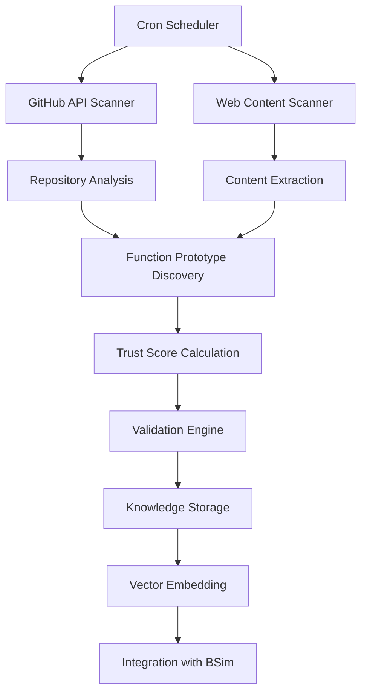

# D2Docs Master Architecture Overview
## AI-Orchestrated Live Analysis Platform

---

## 🎯 **System Overview**

D2Docs is an intelligent reverse engineering platform that combines static analysis, live dynamic analysis, community knowledge mining, and AI-powered insights to create a comprehensive understanding of Diablo 2's codebase. The platform leverages proven Ghidra-MCP workflows with multi-model AI orchestration to provide cost-effective, high-quality analysis.

## 🏗️ **Core Architecture Principles**

### **1. Hierarchical Knowledge Organization**
```
🎮 Diablo 2 Systems (Game-Level Architecture)
├── 👤 Player System
│   ├── 📊 Character Progression Subsystem
│   │   ├── 📈 Experience/Leveling Module (D2Game.dll)
│   │   ├── 🌟 Skill Tree Module (D2Game.dll)
│   │   └── 📋 Stat Calculation Module (D2Common.dll)
│   └── 🎒 Inventory Management Subsystem
├── ⚔️ Combat System
├── 🌍 World/Level System
└── 🔗 Network/Multiplayer System
```

### **2. Multi-Source Knowledge Integration**
- **Static Analysis**: Ghidra-MCP with 110 tools and proven documentation workflows
- **Community Knowledge**: Automated mining from GitHub, forums, and technical sources
- **Live Analysis**: Windows container with native Detours hooks
- **AI Synthesis**: Multi-model orchestration for intelligent analysis and documentation

### **3. Cost-Optimized AI Orchestration**
- **Claude Opus 4.6** (20%): Master coordinator, quality control, strategic decisions
- **Claude Sonnet** (30%): Heavy analysis, complex documentation, system discovery
- **Claude Haiku** (50%): Batch processing, template generation, routine tasks

## 🗄️ **Data Architecture**

### **Primary Data Stores**
```
📊 PostgreSQL + pgvector (Unified Knowledge Store)
├── BSim Database (Existing)
│   ├── exetable - Executable metadata
│   ├── desctable - Function descriptions
│   └── vectable - Vector signatures
├── Hierarchical Knowledge (New)
│   ├── d2_systems - Game system architecture
│   ├── d2_subsystems - Subsystem organization
│   ├── d2_modules - Module-level functionality
│   └── community_function_knowledge - Community insights
├── Vector Search (New)
│   ├── Function embeddings (1536 dimensions)
│   ├── System/subsystem embeddings
│   └── Community knowledge embeddings
└── Provenance & Trust (New)
    ├── community_sources - Source attribution
    ├── system_interactions - Cross-system relationships
    └── trust scoring and validation metrics
```

## 🤖 **AI Orchestration Layer**

### **Master Coordinator (Opus 4.6)**
```python
class AIOrchestrator:
    """
    Master coordinator responsible for:
    - Workflow planning and task assignment
    - Quality control and validation
    - Cost optimization and budget management
    - Performance monitoring and optimization
    """

    def route_request(self, query, context):
        complexity = self.analyze_complexity(query)
        if complexity.requires_deep_analysis:
            return self.assign_to_sonnet(query, context)
        elif complexity.is_batch_operation:
            return self.assign_to_haiku(query, context)
        else:
            return self.handle_directly(query, context)
```

### **Analysis Workers (Sonnet)**
- Execute FUNCTION_DOC_WORKFLOW_V4.md templates
- Perform complex system architecture discovery
- Generate comprehensive documentation using proven formats
- Cross-validate community knowledge against binary analysis

### **Batch Processors (Haiku)**
- Mass variable renaming with Hungarian notation
- Template-based script generation with caching
- Community data extraction and entity recognition
- Progress tracking and completion reporting

## 🌐 **User Interface Architecture**

### **Preserved Three-Panel Flow**
```
Version Selection → Binary Selection → Function List → Enhanced Detail View
     Panel 1            Panel 2         Panel 3         Multi-Tab Interface
```

### **Enhanced Detail View Tabs**
1. **Comparison Tab** (Existing) - Cross-version function comparison
2. **Assembly Tab** (Enhanced) - Static analysis + live correlation
3. **AI Documentation Tab** (New) - Comprehensive AI-generated documentation
4. **Community Knowledge Tab** (New) - Community insights and sources

### **AI Chat Interface**
- **Global Floating Assistant**: Always accessible, context-aware
- **Knowledge Explorer Tab**: Advanced interface with hierarchy browser
- **Contextual Chat**: Function-specific assistance with suggestions

## 🕷️ **Community Knowledge Mining**

### **Automated Discovery Pipeline**


### **Trust Scoring Algorithm**
```python
def calculate_trust_score(source):
    """
    Multi-factor trust scoring:
    - Repository quality (stars, commits, age)
    - Author reputation and contribution history
    - Content quality indicators (documentation, tests)
    - Historical accuracy of previous contributions
    - Cross-validation against binary analysis
    """
    base_score = 0.5
    # Repository factors (max +0.35)
    # Author factors (max +0.1)
    # Content quality (max +0.15)
    # Historical accuracy (max +0.2)
    return min(total_score, 1.0)
```

## 🔄 **Live Analysis Integration**

### **Windows Container Architecture**
```yaml
live-analyzer:
  image: d2-live-analyzer:latest
  environment:
    - DETOURS_MODE=native_hooks
    - D2_VERSION=configurable
    - CORRELATION_DB_HOST=bsim-postgres
  volumes:
    - ./binaries:/d2-binaries:ro
    - ./analysis-output:/analysis-data
```

### **Static/Live Correlation**
- **Real-time Hooks**: Native Windows Detours for function entry/exit
- **Memory Analysis**: Runtime data structure validation
- **Execution Flow**: Dynamic call graph generation
- **Parameter Validation**: Live parameter value analysis

## 📊 **Monitoring & Observability**

### **Real-Time Metrics Dashboard**
```
📊 System Health Monitoring
├── 🤖 AI Model Performance
│   ├── Response times (target: <2s for complex queries)
│   ├── Error rates (target: <1% for routine operations)
│   └── Cost tracking (budget: $50/day with alerts at 80%)
├── 🔍 Vector Search Performance
│   ├── Query response times (target: <500ms)
│   ├── Relevance scores (target: >0.7 average)
│   └── Cache hit rates (target: >60% for repeated queries)
├── 💾 Database Performance
│   ├── Connection pooling efficiency
│   ├── Query optimization metrics
│   └── Storage growth tracking
└── 🕷️ Community Mining Health
    ├── Discovery rates (functions/day)
    ├── Source quality distribution
    └── Validation success rates
```

### **Automated Alerting**
- **Critical**: System downtime, security breaches (immediate)
- **High**: Performance degradation >50%, budget at 100% (15min)
- **Medium**: Storage at 80%, quality degradation (hourly)
- **Low**: Weekly summaries, optimization opportunities (daily)

## 🔒 **Security Framework**

### **Input Validation & Sanitization**
```python
class SecurityValidator:
    def validate_chat_input(self, user_input, session):
        # HTML/script injection prevention
        # Rate limiting (10 queries/minute per session)
        # Content policy enforcement
        # Session validity checks
        # Query complexity limits

    def validate_community_data(self, source_data):
        # Source authenticity verification
        # Malicious code detection
        # License compatibility checking
        # Privacy compliance validation
        # Technical accuracy cross-validation
```

### **API Security**
- **Authentication**: Session-based for admin features
- **Rate Limiting**: Per-IP and per-session limits
- **HTTPS Enforcement**: All external communications encrypted
- **Input Sanitization**: All user inputs validated and sanitized
- **Audit Logging**: All administrative actions logged

## 💰 **Cost Management**

### **Budget Controls**
- **Daily Budget**: $50 with alerts at 80% consumption
- **Cost Protection**: Automatic model degradation at 100% budget
- **Predictive Alerting**: Trend analysis for usage forecasting
- **Model Optimization**: Continuous evaluation of cost vs quality

### **Expected Cost Distribution**
```
Monthly Cost Breakdown (Estimated):
├── AI Model Usage: ~$1,200/month (80% of budget)
│   ├── Opus 4.6 (20% usage): ~$600/month
│   ├── Sonnet (30% usage): ~$450/month
│   └── Haiku (50% usage): ~$150/month
├── Infrastructure: ~$100/month (PostgreSQL, containers)
├── External APIs: ~$50/month (GitHub API, other sources)
└── Storage & Bandwidth: ~$50/month
Total: ~$1,400/month (vs ~$4,200 for all-Opus approach)
```

## 🚀 **Deployment Architecture**

### **Container Orchestration**
```yaml
services:
  # Existing services (preserved)
  bsim-postgres:    # Enhanced with pgvector
  ghidra-server:    # Existing Ghidra backend
  ghidra-web:       # Django web interface

  # New AI services
  ai-orchestrator:  # Multi-model coordination
  vector-search:    # Semantic search engine
  community-miner:  # Knowledge discovery
  live-analyzer:    # Windows analysis container

  # Enhanced monitoring
  monitoring-dashboard: # System health and metrics
  alert-manager:    # Notification and alerting
```

### **Data Flow**
```
User Query → Chat Interface → AI Orchestrator → Task Classification
    ↓
[Sonnet Analysis] OR [Haiku Processing] OR [Opus Coordination]
    ↓
Vector Search ← Knowledge Integration → Community Mining
    ↓
Response Generation ← BSim Database ← Live Analysis
    ↓
User Response + Feedback Collection → Performance Optimization
```

## 📈 **Scalability & Performance**

### **Horizontal Scaling Strategy**
- **AI Orchestration**: Stateless services with load balancing
- **Vector Search**: Read replicas for search-heavy workloads
- **Database**: PostgreSQL streaming replication
- **Caching**: Redis for frequently accessed data

### **Performance Targets**
- **Chat Response Time**: <2 seconds for 95% of queries
- **Vector Search**: <500ms for semantic queries
- **Database Queries**: <100ms for simple lookups
- **Page Load Times**: <1 second for function detail pages
- **System Uptime**: >99.9% availability

## 🔄 **Data Lifecycle Management**

### **Knowledge Evolution**
```
Discovery → Validation → Integration → Verification → Optimization
     ↓         ↓           ↓             ↓              ↓
Community  Trust Score  Vector Store  Binary Check  Performance
Sources    Calculation  Integration   Validation    Tuning
```

### **Quality Assurance**
- **Continuous Validation**: Community knowledge vs binary analysis
- **Trust Score Updates**: Source reliability tracking over time
- **Performance Monitoring**: Query quality and user satisfaction
- **Automated Cleanup**: Low-quality data removal after review period

---

## 📋 **Implementation Phases**

### **Phase 1: Foundation (Days 1-7)**
Core infrastructure, database enhancement, basic AI orchestration

### **Phase 2: Advanced Features (Days 8-16)**
Enhanced chat, community mining, live analysis integration

### **Phase 3: Optimization (Days 17-25)**
Performance tuning, advanced analytics, production readiness

---

This master architecture provides a comprehensive foundation for building an intelligent, cost-effective, and scalable reverse engineering platform that preserves the proven workflows while adding transformative AI capabilities.